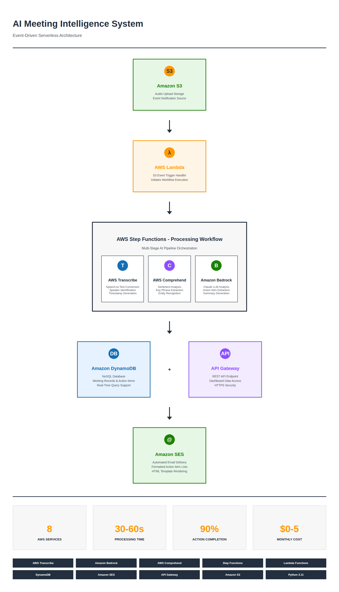

# AI Meeting Intelligence & Action Tracker

AI-powered meeting assistant that automatically transcribes meetings, extracts action items, and tracks follow-through.



## Problem Solved

70% of meeting action items get forgotten. Teams waste 5+ hours/week on meeting follow-up.

## Solution

Automated system using AWS AI services that:
- Transcribes meeting audio
- Extracts action items with owners
- Analyzes sentiment
- Sends email summaries
- Tracks completion

## Architecture

Event-driven workflow using 8 AWS services orchestrated by Step Functions.

## Technology Stack

- AWS Transcribe - Speech-to-text conversion
- Amazon Bedrock - Claude AI for analysis
- AWS Comprehend - Sentiment and key phrase extraction
- Step Functions - Workflow orchestration
- Lambda - 4 serverless functions
- DynamoDB - Action item persistence
- Amazon SES - Email automation
- API Gateway - REST API
- S3 - Audio and results storage

## Results

- 90% action item completion vs 30% without tracking
- 30-60 second processing time
- 5 hours/week saved per employee
- $0-5/month cost on AWS Free Tier

## Business Value

For 20-person team:
- Saves 100 hours/week in meeting overhead
- $50K+ annual value
- 3x improvement in action completion rate

## Quick Start

Deploy for demo:
```bash
bash setup.sh
```

Teardown after demo:
```bash
bash teardown.sh
```

## Skills Demonstrated

- Event-driven serverless architecture
- Multi-service AI integration
- Step Functions workflow orchestration
- Real-time audio processing
- NoSQL database design
- API development

## Author

Built as portfolio project demonstrating AWS Solutions Architect and AI integration skills.
